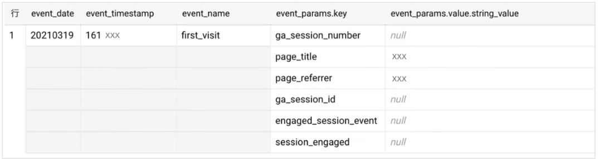

# BigQuery

最終編集日： 2025/9/15

## 概要

テラバイトやペタバイト級の超巨大なデータを、手軽かつ超高速に分析できるサーバーレス・データウェアハウス

## 分析

### クエリが遅いとき

* 管理リソースチャート
  * スロット使用率、ジョブのキューイング、実行時間などの高レベルな概要を視覚的に提供
  * 全体的なリソースの競合状況を把握するのに役立つ

* INFORMATION_SCHEMAに対してクエリ
  * 個々のジョブの詳細なメタデータ（開始時刻、終了時刻、スロット使用量、キューイング時間、実行時間、エラー情報など）を取得
  * 特定のクエリやユーザーがパフォーマンスに影響を与えているかどうかを詳細に分析

### クエリの読み取りデータを少なくしたい

* クラスタリング
* パーティショニング
  * パーティションの有効期限を設定できる
    * タイムスタンプを基にしたパーティション分割した場合、データ保管期間に応じて不要なデータを削除することもできる

## ストレージ

### スキーマ設計

* 従来のオンプレミスのリレーショナルデータベースでは、正規化（情報をテーブルごとに分割して重複をなくすこと）が基本だった
  * 書籍テーブルと著者テーブルを分け、author_id のような共通キーで結合（JOIN）する
* BigQueryのような超大規模データを扱う分析用のデータベースでは、「JOIN」という操作がパフォーマンスの最大のボトルネックになる

* BigQueryのカラムには配列も入れることが可能
  * 各レコードの1個のカラムに複数の値、つまり複数行に相当するデータを入れることができる仕様になっている
    

  * ただし、上記の配列をそのままクエリで参照することはできない
    * 配列の中身を参照するには、いったん配列を「展開」する必要がある
    * それをできるのが UNNEST 関数と CROSS JOIN
      * UNNEST は配列を行に展開する関数
      * CROSS JOIN は総当り的に JOIN する結合方法。