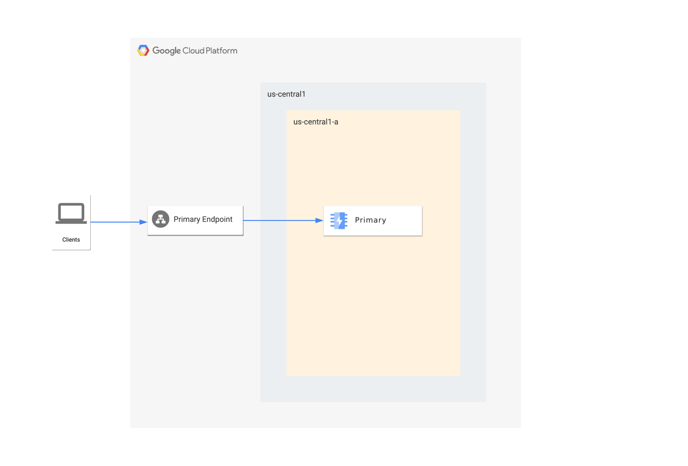
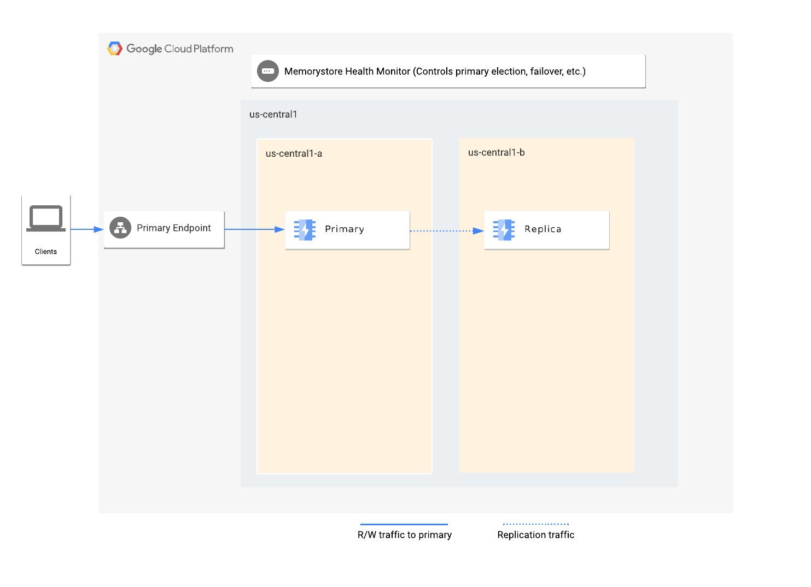
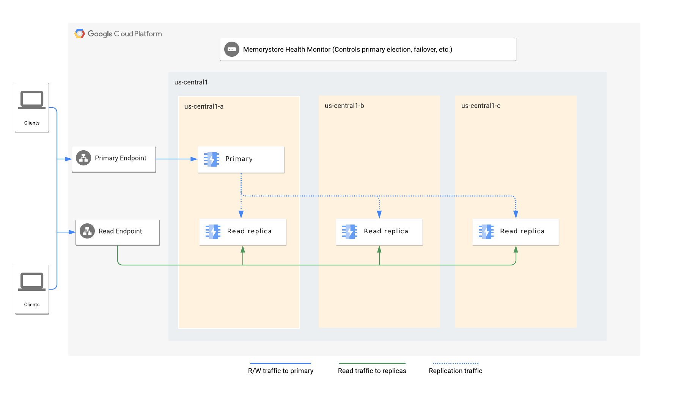

# Memorystore

最終編集日： 2025/9/17

## Memcached vs Redis

**【結論】**
Memcached は文字列のキャッシュに特化した高速な専門家、Redis は豊富なデータ型と永続化に対応した多機能なツールボックス（by Gemini）

### Memcached

ざっくりまとめるとこんな感じ。

* データの永続性をサポートしていない揮発性のデータストア
* あくまで一時的なキャッシュとして設計される
* クラスタ内のノードの数は、最小 1 ノードから最大 20 ノードまでスケーリングできる
* ノードのメモリ容量や vCPU 数をスケーリングすることはできない

#### [可用性](https://cloud.google.com/memorystore/docs/memcached/scale-instances?hl=ja)

* スケールアウト時には、新しいノード IP アドレスを手動でアプリケーションに追加して、アプリケーションがそれらのノードにアクセスできるようにする必要がある
* ただし、[Auto Discovery サービス](https://cloud.google.com/memorystore/docs/memcached/about-auto-discovery?hl=ja)を利用すればこの管理を自動化できる
* スケールインすると、クラスタから削除されるノードに格納されているデータは失われる

#### TBD

XXXXXXXXXXXXXXXXXXXXXXXXXXXXXXXX

### Redis

ざっくりまとめるとこんな感じ

* データの永続化をサポート
* 高可用性（HA）構成が可能で、プライマリノードに障害が発生した場合、自動的にレプリカノードにフェイルオーバーする
* 

#### [サービスティア](https://cloud.google.com/memorystore/docs/redis/redis-tiers?hl=ja#tier_architecture)

* ベーシック ティア
  * 1 個の Redis ノード
  * エフェメラル キャッシュ



* スタンダード ティア（リードレプリカが無効）
  * レプリケーションで高可用性を提供
  * プライマリ ノードで障害が発生した場合はレプリカにフェイルオーバー



* スタンダード ティア（リードレプリカが有効）
  * レプリケーションで高可用性を提供
  * リードレプリカで分散型読み取りが可能



## Memorystore for Valkey

2025/9/15時点ではプレビュー機能のようだが、新しいタイプもあるらしい。


```
（by Gemini）
Memorystore for Valkeyは、オープンソースのValkeyをベースにした新しいサービスで、Redisのオープンソース版からフォーク（分岐）して誕生したという背景が最大の違いです。
簡単に言うと、Valkeyはライセンス変更後のRedisに代わる、コミュニティ主導のオープンソース版Redisと位置づけられています。
```