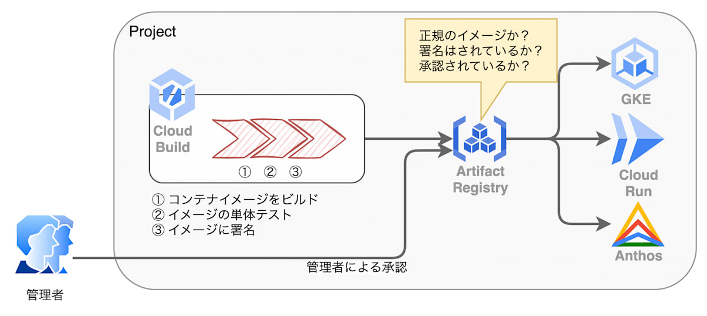
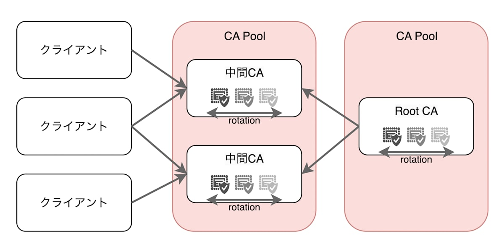

# その他 Security 関連のサービス

最終編集日： 2025/9/27

## IAP（Identity-Aware Proxy）

### 事前定義ロール

* IAP-secured Web App Userロール
  * IAP によって保護されたウェブアプリケーションや HTTPS リソースへのアクセスを許可する
  * 指定されたユーザーだけが IAP の認証を通過してアプリケーションへアクセスできるようになる

## 監査ログ

### 種類

https://cloud.google.com/logging/docs/audit?hl=ja#types

* 管理アクティビティ監査ログ
  * リソースの構成やメタデータを変更するすべての管理操作を記録する
  * 例:
    * 仮想マシンの作成・削除
    * IAMポリシーの変更
* データアクセス監査ログ
  * リソースに保存されているデータを読み取ったり、変更したりする操作を記録する
  * 例:
    * Cloud Storageバケットに保存されているファイルのダウンロード・アップロード
    * BigQueryに保存されているデータに対するクエリの実行
* システム イベント監査ログ
  * ユーザーの直接的な操作ではなく、Google Cloudシステムが自動的に実行した操作によってリソースが変更された場合に記録される
  * 例:
    * Compute Engineの自動スケーリング
    * Cloud SQLのフェイルオーバー
* ポリシー拒否監査ログ
  * ユーザーがGoogle Cloudサービスにアクセスしようとした際に、IAMポリシーやその他のセキュリティポリシーによってアクセスが拒否された場合に記録される
  * 例:
    * 権限不足によるAPI呼び出しの失敗
    * VPC Service Controlsによるアクセス拒否

## Organization Policy（組織ポリシー）

* Google Cloud における最上位リソースの「組織」からその配下リソースに特定の設定や制限を強制させることができるサービス
* コンプライアンス準拠を徹底することができる

* よくあるケース
  * SAや認証認可に関する制約
  * VPC等のネットワーク関連の制約
  * ロケーションなどリソース全体の制約

* ユースケースと設定値例
  | ユースケース | 設定値 |
  | :--- | :--- |
  | SA キーの利用を禁止したい | `iam.disableServiceAccountKeyCreation` |
  | デフォルト SA を無効化したい | `iam.automaticIamGrantsForDefaultServiceAccounts` |
  | VPC Peering の接続を一部に制限したい | `constraints/compute.restrictVpcPeering` |
  | 共有 VPC のサブネット払い出しを一部に制限したい | `constraints/compute.restrictSharedVpcSubnetworks`|
  | リソースのロケーションを限定したい | `constraints/gcp.resourceLocations` |

## Container Analytics

* Artifact Registry に格納されたコンテナの脆弱性スキャンを提供するサービス
* Google Cloud の DevSevOps への取り組みとして非常に重要なポイント

## Binary Authorization

* Artifact Registry がホストするコンテナに署名をすることで、GKE や Cloud Run にデプロイできるコンテナイメージを制御できるサービス
* Container Analytics 同様、Google Cloud の DevSecOps への取り組みとして非常に重要なポイント

* 利用されるケース
  * 本番環境で不正なコンテナイメージを実行させないように制限したい
  * 単体テストなどをクリアしていないコンテナイメージをデプロイできないようにしたい

【署名プロセス】

## Confidential VMs

* Compute Engine VM の一種で、使用中はメモリ内データを常に暗号化し、エンドツーエンドの暗号化とデータの保護を保証
* 機密データを取り扱うワークロードに最適
* AMD Secure Encrypted Virtualization（SEV）を搭載した AMD EPYC プロセッサでのみ動作する点は注意が必要

## Shielded VM

* Compute Engine のセキュリティオプションの1つ
* インスタンスがブートレベルまたはカーネルレベルのマルウェアやルートキットによって改ざんされていないことを保証するもの
  * セキュアブート
  * 仮想トラステッド プラットフォーム モジュール（vTPM）対応のメジャード ブート
  * 整合性モニタリング

## Private Google Access

* 内部 IP アドレスしか持たない GCE インスタンスが Google API へアクセスする場合、Private Google Access を利用することで内部経路を利用したアクセスが可能になる

## Packet Mirroring

* VPC ネットワークへ到達したトラフィックを複製し、フォレンジック用に転送するサービス
* ペイロードとヘッダーを含むすべてのトラフィックとパケットをキャプチャする
* トラフィックを複製することのメリット
  * IDS（Intrusion Detection System）等に連携して持続型の脅威を検出する
  * パケットを検査して異常なペイロードや、様々なベクトルの脅威を検出するきっかけを作る

## Certificate Authority Service（CAS）

* プライベート 認証局を Google Cloud 内に構築し、管理と運用の自動化を行うサービス
* 既存のプライベート認証局と比べて、大きく有利な点がある
  * CA をグループ化できる
  * CA のローテーションが容易
  * エンタープライズのコンプライアンス要件を満たす監査基準
    * ISO 27001、27017、27018、SOC1、SOC2、SOC3、BSI C5、PCI、FedRAMP 監査適合
    * FIPS 140-2 レベル 3 で検証された秘密鍵保護に Google Cloud HSM をデフォルトで使用

* CAS がサポートする証明書の種類
  | 証明書の種類 | 説明 |
  | ---- | ---- |
  | クライアント証明書 | サーバーに接続する**利用者やデバイスの身元**を証明します。 |
  | サーバ証明書 | 利用者に対して**ウェブサイト（サーバー）の身元**を証明し、通信を暗号化します。(SSL/TLS証明書) |
  | mTLS 証明書 | サーバーとクライアントが**お互いの身元を相互に確認**するために利用します。（クライアント/サーバ証明書の両方を使用） |
  | Code Sign | ソフトウェアやコードの**作者が正当であることと、改ざんされていないこと**を証明します。 |
  | e-mail Protection | メールの**送信者が正当であることの証明（署名）と、メール内容の暗号化**を行います。(S/MIME証明書) |

【構成コンポーネント】

* CA（Certificate Authority）
  * Root CA：Root 認証局（必須）
  * Subordinate CA：中間認証局（任意）
* CA Pool：CA を束ね、管理し、ローテーション等を行う CA の集合（必須）
* 証明書：Root CA または Subordinate CA を利用し発行する（必須）

【CA Pool ティア】
| ティア | 規模 | ユースケース | 備考 |
| ---- | ---- | ---- | ---- |
| DevOps | 小〜中規模向け | マイクロサービスやコンテナ等、大量で短期的な利用時に推奨 | ・発行された証明書は保存されない ・証明書の失効がサポートされていない |
| Enterprise | 中〜大規模向け | ライフサイクル管理が重要なデバイス(IoT)等、少量で長期的な利用時に推奨 | CA の QPS クォータが DevOps の1/3程度 |

* Enterprise ティアのメリット
  * 各CAの証明書を発行できる（AIA）
  * 証明書の失効リストが発行できる（CRL）
    * CRL は Google マネージド/ユーザ指定 の GCS バケットに出力することができる