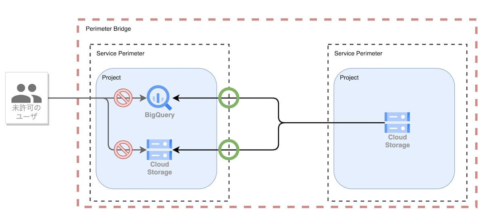
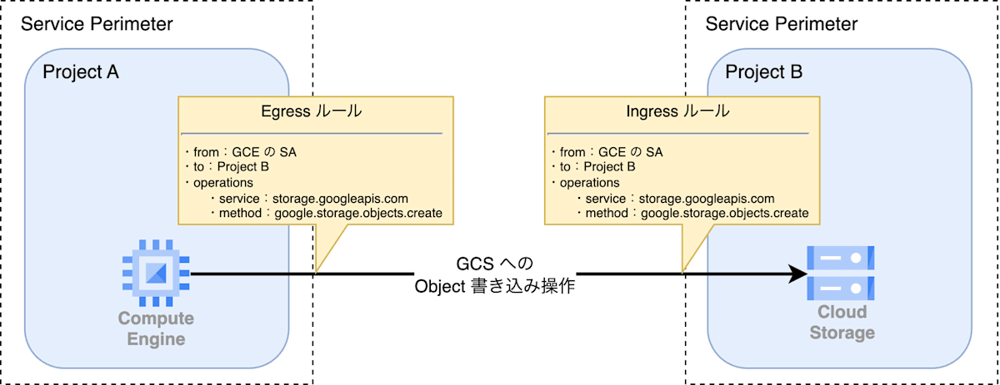

# Security Command Center（SCC）

最終編集日： 2025/9/27

## 概要

API を仮想的な境界を用いて保護することで、境界外からの不正なアクセスを防止するとともに、境界外へのデータの漏洩を防ぐことを目的としたサービス

* 利用するケース
  * GCSバケット内にあるデータをコピーされたくない
  * BQデータセット内にあるデータを閲覧されたくない
  * Spannerデータベース内にあるデータを外部に持ち出されたくない

| コンポーネント名 | 説明 |
| ---- | ---- |
| サービス境界 | APIを保護するコンポーネント |
| アクセスレベル | Google Cloud へのアクセス制限を行うコンポーネント |
| 境界ブリッジ | サービス境界間の通信を許可するコンポーネント、全ての通信を許可する |
| Ingress/Egress ルール | 境界ブリッジよりも細かいメソッド単位のルールを制御する |

【概要図】

【Ingress/Egress】

## 機能